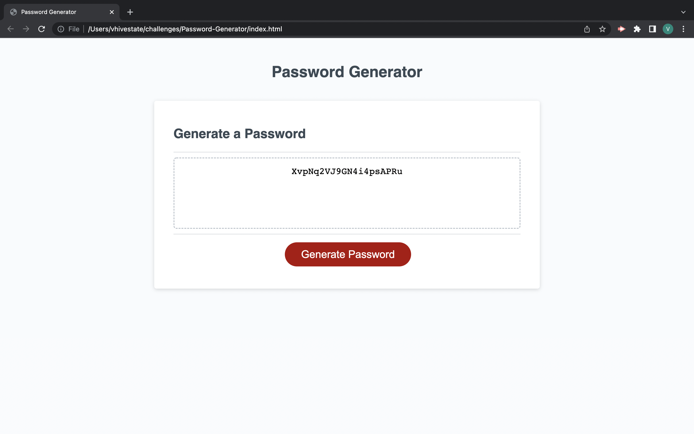

# Password-Generator
## Purpose
The purpose of this webage is to generate a random password.
There will be 4 windows that pop up when user clicks on the "Generate" botton. Users will get the option to choose the length, as well as, whether they want to include uppercase letters, lowercase letters, numbers, & special characters. 
 
However, if user inputs a number less than 8 or greater than 128 they will have to click the generate button again to select a number within the given length because the website won't do anything. 
 

## Built With
* JavaScript
* CSS
* HTML

### Web link:
- My [website](https://vhivestate.github.io/password-generator/)

## Screenshot

## Contribution
Made with ❤️ by Valeria